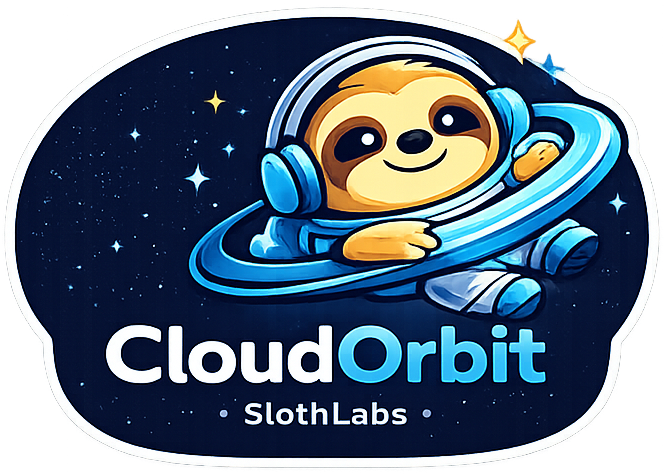
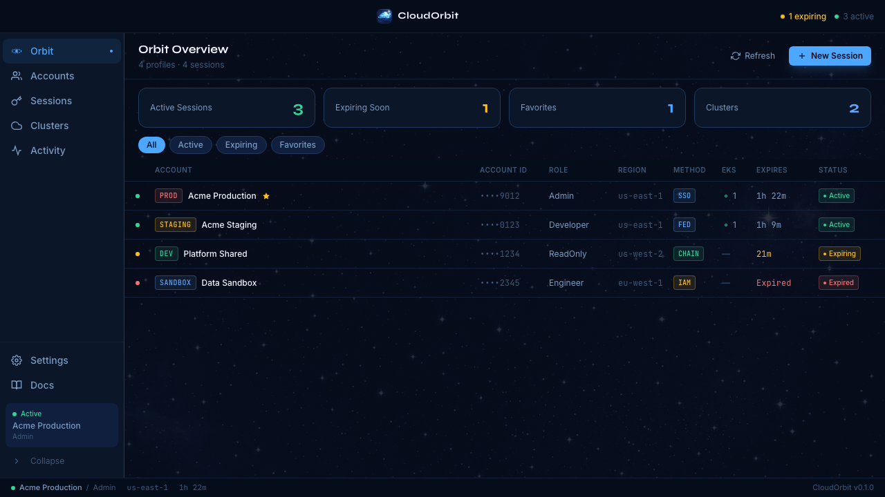

<div align="center">
  
  <br /> 
  

  <h1>  CloudOrbit <small style="font-size: small">by SlothLabs </small> </h1>
  <p><strong>Multi-cloud access control — free forever, open to contributions.</strong></p>

  [](https://github.com/slothlabs/cloudorbit/releases)
  [](LICENSE)
  [](https://github.com/sponsors/slothlabs)
  [](https://ko-fi.com/slothlabs)
</div>

---

CloudOrbit is a native desktop app for engineers who juggle multiple cloud accounts and environments. Manage sessions, credentials, clusters, and the web console — all in one place, without touching a terminal.

**Currently supported:** AWS — GCP and Azure coming soon.

## Features

- **SSO login** — one-click authentication across all accounts and roles
- **Session management** — track credentials, expiry, and active sessions at a glance
- **Kubernetes** — discover clusters and update `~/.kube/config` in one click
- **EC2 / SSM** — browse instances and open browser-based shell sessions
- **Web Console** — federated sign-in directly into your cloud provider's console
- **Auto-update** — new versions install silently in the background
- **macOS, Windows, Linux** — single codebase, native packaging

## Install

### macOS

```bash
# Homebrew (recommended)
brew install --cask slothlabs/tap/cloudorbit

# Or download the .dmg from the Releases page
```

### Windows

```powershell
winget install SlothLabs.CloudOrbit
```

### Linux

Download the `.deb` or `.AppImage` from [Releases](https://github.com/slothlabs/cloudorbit/releases).

## Screenshots



## Development

**Prerequisites:** Rust 1.78+, Node 18+, npm

```bash
git clone https://github.com/slothlabs/cloudorbit
cd cloudorbit

npm install
npm run tauri dev    # starts Vite dev server + Rust hot-reload
```

See [CONTRIBUTING.md](CONTRIBUTING.md) for the full guide.

## Tech stack

| Layer | Technology |
|-------|-----------|
| Shell | Tauri v2 |
| Frontend | React 18 + TypeScript + Tailwind CSS |
| Backend | Rust — cloud provider SDKs |
| Testing | Vitest (unit) · Playwright (interaction/screenshot) |

## Roadmap

### v0.2 — Planned

- **Okta / SAML IdP login** — support for companies that authenticate via an identity provider (Okta, Ping, ADFS) using the `signin.aws.amazon.com/saml` flow. CloudOrbit will intercept the SAML assertion, let the user pick a role, and write temporary credentials automatically — no manual ARN configuration needed.
- GCP support
- Azure support

> Have a feature request? [Open an issue](https://github.com/slothlabs/cloudorbit/issues).

## Contributing

We love contributions! Please read [CONTRIBUTING.md](CONTRIBUTING.md) before opening a PR.

Found a security issue? See [SECURITY.md](SECURITY.md).

## Support

CloudOrbit is completely free. If it saves you time, consider supporting the project:

- ☕ [Ko-fi](https://ko-fi.com/slothlabs) — one-time or recurring coffee
- ❤️ [GitHub Sponsors](https://github.com/sponsors/slothlabs) — monthly or one-time
- ⭐ Star this repo — it helps others find the project

## License

Source-available under the [Functional Source License 1.1 (FSL-1.1-MIT)](LICENSE).
Free to use, read, and contribute to. Cannot be forked into a competing product.
Converts to MIT on 2028-01-01. See [TRADEMARK.md](TRADEMARK.md) for brand usage.
