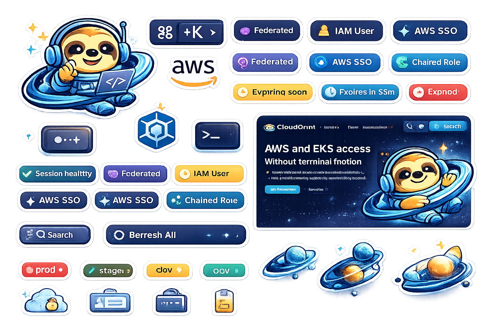
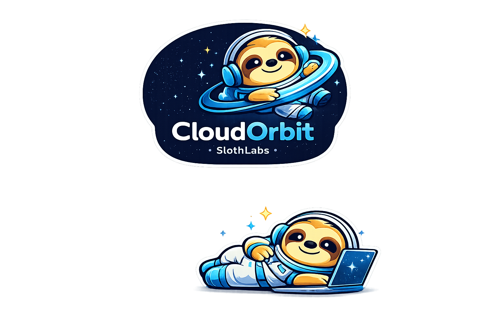
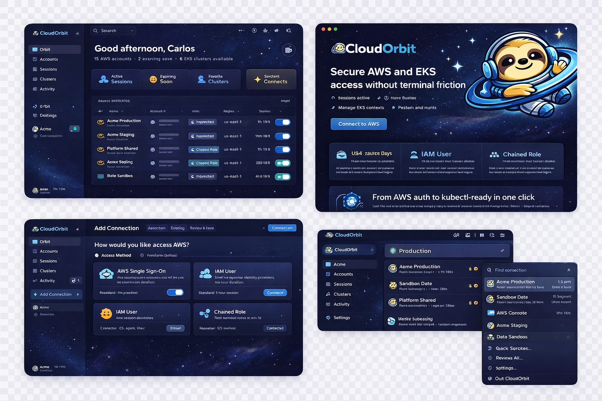

# CloudOrbit — Complete UI/UX Rebuild Task

## Tauri + Rust + React/TypeScript

> This is a single comprehensive task. Read every section before writing any code.
> This replaces and elevates the existing UI. Preserve all working Rust/Tauri backend logic.
> Rebuild the frontend from the ground up with the visual and UX standard described here.

-----

## 0. CONTEXT & MINDSET

You are rebuilding the UI of CloudOrbit, a macOS desktop app built with Tauri (Rust backend, React/TypeScript frontend).

**What CloudOrbit is:**
A premium visual AWS and EKS access manager. Alternative to Leapp, but with significantly better UX, clearer session visibility, stronger EKS support, and a macOS-native premium feel.

**What it must feel like:**
A blend of Linear + Raycast + Arc + 1Password + macOS system utilities.

- Premium, calm, fast, trustworthy
- NOT cluttered, NOT enterprise-dashboard, NOT generic SaaS
- Every interaction should feel intentional and polished

**Your job:**

1. READ all existing source files before touching anything
1. PRESERVE all Rust commands, Tauri invoke calls, and backend logic
1. REBUILD the entire frontend UI layer to match this specification
1. Keep what already works well, elevate everything else

**Award-level bar:**
Design as if competing for CSS Design Awards and Awwwards.
A senior macOS developer should open this app and say “this feels native and premium.”

-----

## 1. TECH STACK (do not change)

```
Tauri 2.x (Rust backend)
React 18 + TypeScript (frontend)
Tailwind CSS (styling)
Framer Motion (animations)
```

Frontend-only changes. Do NOT modify:

- `src-tauri/src/` Rust source files
- `tauri.conf.json` core settings
- Existing `invoke()` command names and signatures
- Cargo.toml dependencies

If a Rust command needs a new frontend handler, add only the TypeScript side.

-----

## 2. DESIGN SYSTEM

### 2.1 Color Tokens

```css
/* Base */
--color-bg-base:        #060d1a;   /* deepest background */
--color-bg-elevated:    #0b1628;   /* main panels */
--color-bg-surface:     #0f1f3d;   /* cards, rows */
--color-bg-surface-2:   #152a4e;   /* hover states */
--color-bg-overlay:     #1a3460;   /* modals, popovers */

/* Borders */
--color-border:         #1e3a5f;
--color-border-subtle:  #142038;
--color-border-focus:   #4DA6FF;

/* Brand */
--color-primary:        #4DA6FF;   /* SlothLabs blue */
--color-primary-glow:   rgba(77,166,255,0.15);
--color-primary-dim:    rgba(77,166,255,0.08);

/* Semantic */
--color-success:        #34d399;
--color-warning:        #fbbf24;
--color-danger:         #f87171;
--color-info:           #60a5fa;

/* Environment badges */
--color-prod:           #ef4444;   /* red */
--color-staging:        #f59e0b;   /* amber */
--color-dev:            #3b82f6;   /* blue */
--color-sandbox:        #8b5cf6;   /* purple */

/* Text */
--color-text-primary:   #f0f6ff;
--color-text-secondary: #7a9cc4;
--color-text-muted:     #3d5a7a;
--color-text-disabled:  #253d57;

/* Access method chips */
--color-sso:            #a78bfa;   /* purple */
--color-iam-user:       #fbbf24;   /* amber */
--color-federated:      #34d399;   /* green */
--color-chained:        #60a5fa;   /* blue */
```

### 2.2 Typography

```css
/* Import in index.html */
@import url('https://fonts.googleapis.com/css2?family=Inter:wght@400;500;600&family=Syne:wght@700;800&family=JetBrains+Mono:wght@400;500&display=swap');

--font-display: 'Syne', sans-serif;       /* screen titles only */
--font-ui:      'Inter', sans-serif;      /* all UI text */
--font-mono:    'JetBrains Mono', monospace; /* IDs, ARNs, code */

/* Scale */
--text-xs:   11px;
--text-sm:   12px;
--text-base: 13px;   /* default UI size */
--text-md:   14px;
--text-lg:   16px;
--text-xl:   20px;
--text-2xl:  24px;
--text-3xl:  32px;
```

### 2.3 Spacing & Shape

```css
--radius-sm:   6px;
--radius-md:   10px;
--radius-lg:   14px;
--radius-xl:   20px;
--radius-full: 9999px;

--shadow-glow-blue:  0 0 20px rgba(77,166,255,0.12);
--shadow-glow-teal:  0 0 20px rgba(0,212,255,0.10);
--shadow-card:       0 2px 12px rgba(0,0,0,0.4);
--shadow-modal:      0 8px 40px rgba(0,0,0,0.7);
```

### 2.4 Animation Standards

```ts
// All transitions use these presets
const spring = { type: 'spring', stiffness: 300, damping: 30 }
const easeOut = { duration: 0.2, ease: [0.16, 1, 0.3, 1] }
const stagger = { staggerChildren: 0.05 }

// Page transitions: fade + translateY(8px) → translateY(0)
// Row hover: translateY(-1px) + border color change
// Modal: scale(0.96) + opacity 0 → scale(1) + opacity 1
// Sidebar collapse: width spring animation
```

-----

## 3. GLOBAL LAYOUT

### 3.1 Three-Panel Shell

```
┌─────────────────────────────────────────────────────────┐
│  Traffic lights  │  Drag region (title bar)             │
├──────────┬────────────────────────┬──────────────────────┤
│          │                        │                      │
│ SIDEBAR  │    MAIN CONTENT        │   DETAIL PANEL       │
│  200px   │    flex-1              │   320px (optional)   │
│          │                        │                      │
│          │                        │                      │
│          │                        │                      │
├──────────┴────────────────────────┴──────────────────────┤
│  Status bar (account · expiry · cluster context)         │
└─────────────────────────────────────────────────────────┘
```

The detail panel slides in/out with a spring animation when an item is selected.
On screens < 1200px wide, the detail panel overlays as a drawer instead.

### 3.2 Titlebar (macOS native)

```tsx
// tauri.conf.json should have decorations: false
// Implement custom titlebar:

<div data-tauri-drag-region className="titlebar">
  {/* macOS traffic lights — leave space: 72px left padding */}
  <div className="titlebar-center">
    <CloudOrbitLogo />  {/* small icon + wordmark */}
  </div>
  <div className="titlebar-right">
    <ConnectionStatus />  {/* green dot + "3 active" */}
    <MenuBarToggle />
    <WindowControls />
  </div>
</div>
```

### 3.3 Sidebar

Width: 200px (collapsible to 52px icon rail)

Structure:

```
[CloudOrbit logo]
──────────────────
NAVIGATE
  🌐 Orbit          (overview)
  🔑 Accounts
  ⚡ Sessions
  ☸️  Clusters
  📋 Activity
──────────────────
SYSTEM
  📖 Docs
  ⚙️  Settings
──────────────────
[Active account pill]
  Acme · 1h 13m
  [status dot]
──────────────────
[Bottom: version + collapse toggle]
```

Active nav item: `--color-primary` left border (2px) + `--color-bg-surface-2` background
Hover: `--color-bg-surface` background, smooth 150ms

### 3.4 Status Bar (bottom)

```
[●] Acme Production  │  Admin  │  Expires in 47m  │  ☸️ prod-cluster (current)  │  ⌘K Search
```

Height: 28px. Font: –text-xs, –color-text-secondary.
Click on any segment navigates to relevant screen.

-----

## 4. SCREEN SPECIFICATIONS

-----

### 4.1 ORBIT OVERVIEW  `/orbit`

**Purpose:** Command center. User understands full AWS + EKS state in < 10 seconds.

**Header:**

```
Orbit Overview
12 AWS accounts · 3 active sessions · 6 EKS clusters available
                                              [Search] [Renew All] [⌘K]
```

**Summary Cards Row** (4 cards, equal width):

```tsx
interface SummaryCard {
  icon: ReactNode
  label: string
  count: number
  sublabel: string
  variant: 'blue' | 'warning' | 'success' | 'purple'
  onClick: () => void  // navigates to relevant screen
}
```

Cards:

1. Active Sessions — count, “All healthy” or “1 expiring soon” — blue
1. Expiring Soon — count, “within 30 minutes” — warning (if 0, hide or dim)
1. Favorite Accounts — count, “quick access” — purple
1. Available Clusters — count, “ready to activate” — success

Card design:

- bg: `--color-bg-surface`
- border: 1px `--color-border`
- hover: border `--color-primary`, shadow-glow-blue
- icon: 32px, colored background circle (10% opacity of variant color)
- count: Syne 800, 28px, white
- bottom: sublabel in –text-secondary

**Accounts Table** (main content):

Section header: “Accounts” + filter chips: All · Active · Expiring · Favorites

```
Columns:
┌──────────────────┬──────────────┬────────────┬──────────┬──────────┬────────┬───────────┬────────┐
│ Account          │ Account ID   │ Role       │ Region   │ Method   │ EKS    │ Expires   │ Status │
├──────────────────┼──────────────┼────────────┼──────────┼──────────┼────────┼───────────┼────────┤
│ 🟡 Acme Prod     │ ••••3421     │ Admin      │ us-east-1│ [SSO]    │ 3      │ 1h 13m    │ ● Live │
│ 🔵 Acme Staging  │ ••••8821     │ Developer  │ us-east-1│ [Federated]│ 1    │ 1h 10m    │ ● Live │
│ 🟣 Platform Shr  │ ••••1234     │ ReadOnly   │ us-west-2│ [Chained]│ 0     │ 28m ⚠️    │ ⚠ Exp  │
│ ⬜ Role Sandbox  │ ••••5599     │ Admin      │ eu-west-1│ [IAM]    │ 2     │ 4h 19m    │ ○ Idle │
└──────────────────┴──────────────┴────────────┴──────────┴──────────┴────────┴───────────┴────────┘
```

Row behaviors:

- Click row → open Detail Panel (slide in from right)
- Hover → show inline action buttons: [▶ Start] [↻ Renew] [🔗 Console] [☸ Clusters] [···]
- Expiring < 30min: row gets amber left border + warning icon
- Expired: row dims to 50% opacity + red “Expired” chip + [Re-auth] button

**Environment badge** (colored pill, left of account name):

- prod: red `●`
- staging: amber `●`
- dev: blue `●`
- sandbox: purple `●`

**Method chips:**

- [SSO] purple, [IAM User] amber, [Federated] green, [Chained] blue
- Pill style: 5px radius, colored bg at 15% opacity, colored text

**Expiry column:**

- 2h: `--color-text-secondary`, no decoration
- 30m–2h: `--color-warning`, no decoration
- < 30m: `--color-danger` + ⚠️ icon + subtle pulse animation
- Expired: red “Expired” text

**Detail Panel — Selected Account:**

```
[Account Alias]          [Edit] [···]
AWS ID: ••••3421         [Copy]
─────────────────────────────────
Method:    [AWS SSO]
Role:      Admin
Region:    us-east-1
─────────────────────────────────
Session Status
● Active — Expires in 1h 13m
[████████████████░░░░] 78%
[↻ Renew Session]  [🔗 Open Console]
─────────────────────────────────
Linked Clusters (3)
  ☸ prod-cluster     us-east-1  [Activate]
  ☸ staging-cluster  us-east-1  [Activate]
  ☸ tools-cluster    us-west-2  [Activate]
─────────────────────────────────
Recent Activity
  12:04  Session started
  11:32  kubeconfig updated
  10:15  Session renewed
```

**Empty States:**

- No accounts: Sloth mascot illustration + “No connections yet” + [Add Connection] button
- Loading: skeleton rows with shimmer animation (no spinners)
- Error: inline banner “Could not load accounts. Check your connection.” + [Retry]
- No active sessions: info callout, not an error

-----

### 4.2 ACCOUNTS  `/accounts`

**Header:**

```
Accounts
Manage AWS access points, aliases, roles, and connection settings.
                    [Search accounts...] [+ Add Connection]
```

**Filter bar:**

```
All  |  SSO  |  IAM User  |  Federated  |  Chained  |  ★ Favorites  |  Active only
```

**Account list** (same table as Orbit but more columns visible):
Additional columns: Last Used, Notes indicator, Favorite star

**+ Add Connection button** → opens Add Connection Wizard (modal, see §4.8)

**Detail Panel — 5 tabs:**

Tab 1: Overview

```
[★ Favorite toggle]
Alias:        Acme Production
Account ID:   123456789012    [Copy]
Region:       us-east-1
Access:       AWS SSO
Token life:   1 hour (standard)
Notes:        [text area, editable inline]

[Edit]  [Test Connection]  [Duplicate]  [Remove]
```

Tab 2: Roles

```
Available roles for this account:
┌────────────────────────┬─────────────┬────────┐
│ Role ARN               │ Display Name│ Default│
├────────────────────────┼─────────────┼────────┤
│ arn:aws:iam::…/Admin   │ Admin       │  ●     │
│ arn:aws:iam::…/ReadOnly│ Read Only   │        │
└────────────────────────┴─────────────┴────────┘
[+ Add Role]
```

Tab 3: Clusters

```
EKS clusters detected for this account:
☸ prod-cluster      us-east-1   prod    Last activated: 2h ago
☸ staging-cluster   us-east-1   staging Last activated: 5d ago
[Detect Clusters]
```

Tab 4: Session Rules

```
Auto-renew:        [Toggle ON]
Notify at:         [30 minutes] before expiry
Session name:      [cloudorbit-{alias}-{date}]
Max session hours: [8h ▾]
```

Tab 5: Security

```
Credential storage: macOS Keychain ✓
Long-term keys:     Not stored ✓
Last credential rotation: 2h ago

[Remove Account]  ← red, confirmation required
```

-----

### 4.3 ADD CONNECTION WIZARD

**Modal style:**

- Centered, 680px wide, max-h 80vh
- bg: `--color-bg-elevated`
- Border: `--color-border`
- Shadow: `--shadow-modal`
- Backdrop blur behind

**Progress indicator (top):**

```
① Access Method  →  ② Configuration  →  ③ Validate  →  ④ Save
```

Active step: `--color-primary` + filled circle
Completed step: checkmark + `--color-success`

**Step 1: Choose Access Method**

4 cards in 2×2 grid:

```
┌──────────────────────┐  ┌──────────────────────┐
│  ✦  AWS Single       │  │  👤  IAM User         │
│     Sign-On          │  │                       │
│                      │  │  Use long-term IAM    │
│  Best for orgs with  │  │  credentials to get   │
│  browser-based AWS   │  │  temp session tokens. │
│  access.             │  │                       │
│  Standard: 1h session│  │  Standard: 1h session │
│                      │  │                       │
│  [Select]            │  │  [Select]             │
└──────────────────────┘  └──────────────────────┘
┌──────────────────────┐  ┌──────────────────────┐
│  🔗  Federated Role  │  │  🔄  Chained Role     │
│                      │  │                       │
│  SAML-based access   │  │  Use one trusted      │
│  with short-lived    │  │  session to assume    │
│  credentials.        │  │  another role.        │
│                      │  │                       │
│  [Select]            │  │  [Select]             │
└──────────────────────┘  └──────────────────────┘
```

Selected card: border `--color-primary`, bg `--color-primary-dim`, checkmark top-right

**Step 2: Configuration (adaptive form)**

SSO fields:

- Start URL (https://…awsapps.com/start)
- Region (select dropdown, sorted)
- Account Alias (friendly name)
- Default role (optional)
- Tags (environment: prod/staging/dev/sandbox)
- Mark as favorite (toggle)

IAM User fields:

- Access Key ID (masked input)
- Secret Access Key (masked, show/hide toggle)
- Account Alias
- Default Region

Federated Role fields:

- Provider URL / metadata
- Role ARN (mono font)
- Principal ARN (mono font)
- Alias
- Default Region

Chained Role fields:

- Source account / session (dropdown from existing accounts)
- Target Role ARN (mono font)
- Alias
- Region

Form UX rules:

- Inline validation on blur (not on type)
- ARN fields validate format with regex
- Error: red border + message below field
- Help text: `--color-text-muted` below field label
- Sensitive fields: never autofill, show/hide eye toggle
- “Why is this needed?” tooltip on sensitive fields

**Step 3: Validate Access**

```
Validating your connection...

✓  Identity reachable          (200ms)
✓  STS token generated         (340ms)
⟳  Checking available roles... (loading)
○  EKS detection               (pending)
○  Default region valid        (pending)
```

Each check: icon (spinner/check/warning/x) + label + duration
On partial failure:

```
⚠  Could not detect EKS clusters
   Your IAM policy may not include eks:ListClusters
   [Continue anyway]  [Fix permissions]
```

Full failure:

```
✗  Connection failed
   STS returned: InvalidClientTokenId
   Check your credentials and try again.
   [← Back to edit]  [Retry]
```

**Step 4: Save & Organize**

```
Connection validated ✓

Alias:           [Acme Production        ]
Environment:     [prod ▾]  ← color-coded
Color label:     ● ● ● ● ●  (pick color)
Default role:    [Admin ▾]
Note:            [optional description   ]
★ Mark as favorite

[Cancel]                    [Save Connection]  [Save & Start Session]
```

-----

### 4.4 SESSIONS  `/sessions`

**Header:**

```
Sessions
Monitor short-lived access, renew when needed, and keep context visible.
                    [Search] [↻ Renew All]
```

**Filter tabs:**

```
All (8)  |  Active (3)  |  Expiring (1)  |  Expired (2)  |  Requires Auth (2)
```

**Sessions table:**

```
┌────────────────┬──────────┬────────────┬──────────┬─────────────┬──────────┬──────────┐
│ Account        │ Role     │ Method     │ Started  │ Expires in  │ Auto-renew│ Status  │
├────────────────┼──────────┼────────────┼──────────┼─────────────┼──────────┼──────────┤
│ Acme Prod      │ Admin    │ [SSO]      │ 12:04    │ 1h 13m      │ ✓        │ ● Healthy│
│ Platform Shr   │ ReadOnly │ [Chained]  │ 11:30    │ 22m ⚠       │ ✓        │ ⚠ Expiring│
│ Data Sandbox   │ Engineer │ [IAM]      │ Yesterday│ Expired     │ ✗        │ ✗ Expired│
└────────────────┴──────────┴────────────┴──────────┴─────────────┴──────────┴──────────┘
```

**Expiry progress bar** (in row, under expires column):

```
Active:   [████████████░░░░░░░░] 63% remaining
Expiring: [███░░░░░░░░░░░░░░░░░] 18% remaining (amber)
Expired:  [░░░░░░░░░░░░░░░░░░░░] 0% (red, dimmed row)
```

**Status chips:**

- `● Healthy` — green dot + text
- `⚠ Expiring Soon` — amber
- `↻ Refreshing` — spinning icon + blue
- `🔐 Requires Sign-in` — lock icon + amber
- `✗ Expired` — red

**Row hover actions:**
`[↻ Renew]  [🔐 Re-auth]  [🔗 Console]  [☸ Clusters]  [✕ End]`

**Renew behavior by method:**

- SSO: triggers browser-based re-auth (opens system browser)
- IAM User: uses stored credentials to call STS silently
- Federated: triggers SAML flow
- Chained: re-assumes from source session

**Detail Panel — Session:**

```
Acme Production / Admin
─────────────────────────────────
Method:       AWS SSO
Started:      Today 12:04 PM
Expires:      Today 1:04 PM
Last renewed: 11:47 AM
Auto-renew:   Enabled
─────────────────────────────────
Token expiry
[████████████░░░] 1h 13m remaining
─────────────────────────────────
Linked clusters (2)
  ☸ prod-cluster   [Activate]
  ☸ tools-cluster  [Activate]
─────────────────────────────────
Activity
  12:47  Session auto-renewed
  12:04  Session started
  11:32  kubeconfig updated
─────────────────────────────────
[↻ Renew Now]  [✕ End Session]
```

**Bulk actions (when rows selected):**
Floating action bar at bottom:

```
3 sessions selected  │  [↻ Renew Selected]  [✕ End Selected]  [✕ Clear selection]
```

-----

### 4.5 CLUSTERS  `/clusters`

**Header:**

```
Clusters
Activate EKS access, manage kube contexts, and work safely across environments.
                    [Search clusters...] [↻ Detect All]
```

**Filter bar:**

```
All  |  Active Context  |  prod  |  staging  |  dev
```

**Clusters table:**

```
┌──────────────────┬──────────────┬──────────┬─────────┬────────────────┬──────────┬──────────┐
│ Cluster          │ Account      │ Region   │ Env     │ Kube Context   │ Namespace│ Status   │
├──────────────────┼──────────────┼──────────┼─────────┼────────────────┼──────────┼──────────┤
│ prod-cluster     │ Acme Prod    │ us-east-1│ 🔴 prod │ acme-prod-main │ default  │ ✓ Active │
│ staging-cluster  │ Acme Staging │ us-east-1│ 🟡 stg  │ acme-stg-main  │ kube-sys │ ○ Idle   │
│ tools-cluster    │ Platform Shr │ us-west-2│ 🔵 dev  │ —              │ —        │ ○ Not set│
└──────────────────┴──────────────┴──────────┴─────────┴────────────────┴──────────┴──────────┘
```

**Production safety:**

- Prod rows: persistent red left border (3px)
- “Set as current context” on prod cluster: shows confirmation modal
- Settings option: “Safe mode — require confirmation for prod context switch”

**Activate Cluster flow:**

Step 1 — Validate session:

```
Activating prod-cluster...
✓ AWS session valid (Acme Production / Admin)
✓ EKS cluster reachable
✓ kubeconfig file found at ~/.kube/config
```

Step 2 — Context options:

```
Context name:    [acme-prod-main        ]  (editable)
Merge with existing kubeconfig:  ● Yes  ○ Replace
Set as current context:          [Toggle]

⚠ This is a production cluster. Double-check before proceeding.
```

Step 3 — Confirm & activate:

```
✓ kubeconfig updated
✓ Context added: acme-prod-main
✓ Set as current context: Yes

kubectl get nodes  →  [Copy]
```

**Detail Panel — Cluster:**

Tab 1: Overview

```
prod-cluster
─────────────────────────────────
Account:      Acme Production
Role:         Admin
Region:       us-east-1
Environment:  🔴 Production
─────────────────────────────────
Session backing this cluster:
● Active — 1h 13m remaining
─────────────────────────────────
Last activated: 2 hours ago
Current context: acme-prod-main ✓
─────────────────────────────────
[Activate Cluster]  [Open Terminal]
[Copy kubectl cmd]
```

Tab 2: Namespaces

```
Detected namespaces:
  default          (system)
  kube-system      (system)
  monitoring       (custom)
  payments-api     (custom)   ← set as default
  auth-service     (custom)

Default namespace: [payments-api ▾]
[Remember for this cluster]
```

Tab 3: Context

```
Current context name:  acme-prod-main
kubeconfig path:       ~/.kube/config
Last updated:          2h ago
Merge behavior:        Merge (safe)
Backup created:        ✓ ~/.kube/config.bak.20250313

[Re-activate]  [Remove context]
```

Tab 4: Access

```
Backing AWS session:   Acme Production / Admin
Session expires:       1h 13m
EKS token expires:     12m  ← EKS tokens are 15min

⚠ EKS token expires in 12m. Re-activate after renewing session.

[Renew Session]  [Re-activate Cluster]
[Troubleshoot Access]
```

**Error states:**

- Session expired while activating → red banner + [Renew Session first]
- kubeconfig not found → prompt to create at default path
- Context collision → show diff, ask merge or rename
- No clusters detected → info state with [Detect Clusters] + IAM help link

-----

### 4.6 ACTIVITY  `/activity`

**Header:**

```
Activity
Track session starts, renewals, cluster activations, and authentication events.
                    [Search activity...] [Export]
```

**Filter tabs:**

```
All  |  Sessions  |  Clusters  |  Auth  |  Errors
```

**Timeline view** (grouped by day):

```
TODAY
─────────────────────────────────────────────────────
13:42  ✓  Session started          Acme Production / Admin      SSO
13:40  ↻  Session renewed          Platform Shared / ReadOnly   Chained
12:47  ↻  Session auto-renewed     Acme Production / Admin      SSO
12:04  ☸  Cluster activated        prod-cluster                 Acme Prod
12:04  ✓  Session started          Acme Production / Admin      SSO
11:32  ☸  kubeconfig updated       staging-cluster              Acme Staging

YESTERDAY
─────────────────────────────────────────────────────
18:15  ✗  Session expired          Data Sandbox / Engineer      IAM
17:42  ⚠  Re-auth required         Data Sandbox / Engineer      IAM
```

Row structure:

- Time: mono, muted
- Icon: colored by event type
- Event: primary text
- Reference: account/cluster (clickable, navigates there)
- Method chip

**Event icons by type:**

- Session started: ✓ green
- Session renewed: ↻ blue
- Session expired: ✗ red
- Re-auth required: 🔐 amber
- Cluster activated: ☸ blue
- kubeconfig updated: 📄 teal
- Context changed: 🔀 purple
- Auth failed: ✗ red
- Account added: + green
- Account removed: − muted

**Detail drawer** (slide from right on row click):

```
Session Started
─────────────────────────────────
Time:        Today 13:42:07
Account:     Acme Production
Role:        Admin
Method:      AWS SSO
Duration:    Started (active)
─────────────────────────────────
Technical detail:
  STS AssumeRoleWithWebIdentity
  Session ID: AQoXnyc4EXAMPLE...
  Token ARN:  arn:aws:sts::…
─────────────────────────────────
[Copy diagnostics]  [Go to Session]
```

-----

### 4.7 SETTINGS  `/settings`

Sidebar within settings (nested nav):

```
General
  › Appearance
  › Startup
  › Notifications

AWS
  › Default Region
  › Session Defaults
  › Credential Storage

Kubernetes
  › kubeconfig Path
  › Context Behavior
  › Production Safety

Security
  › Keychain Access
  › Audit Log
  › Data Privacy

Advanced
  › Logs
  › Diagnostics
  › Developer Mode
  › Reset App
```

**Key settings to implement:**

General > Appearance:

- Theme: Dark (only, space theme)
- Sidebar: Expanded / Collapsed / Auto
- Status bar: Show / Hide
- Menu bar: Always / When active / Never
- Reduce motion: toggle (respects `prefers-reduced-motion`)

AWS > Session Defaults:

- Default session duration: [1h / 4h / 8h / 12h] dropdown
- Auto-renew by default: toggle
- Notify before expiry: [15m / 30m / 1h] dropdown

Kubernetes > Production Safety:

- Safe mode (confirm before setting prod as current context): toggle ON by default
- Production keywords: [prod, production, live] (editable tags)
- Auto-backup kubeconfig before changes: toggle ON by default
- Default namespace behavior: [Remember per cluster / Always default]

Security > Keychain:

- All credentials stored in macOS Keychain
- [View stored entries] → opens Keychain section
- [Clear all credentials] → destructive, confirmation required

Advanced > Logs:

- Log level: [Info / Debug / Trace]
- [Open log file]
- [Copy last 100 lines]
- [Clear logs]

-----

### 4.8 DOCS  `/docs`

**Layout:**

- Left sidebar (docs nav, 220px)
- Content area (max-w-2xl, centered)

**Docs nav structure:**

```
Getting Started
  › Introduction
  › Installation
  › Quick Start

Configuration
  › AWS Setup
  › IAM Profiles
  › SSO Setup

Features
  › Session Management
  › EKS Integration
  › kubeconfig Update
  › Menu Bar

Troubleshooting
  › Cloudflare Networks
  › Common Issues
  › Diagnostics
```

**Installation page content:**

Platform tabs: macOS | Windows | Linux

macOS:

```
Download the .dmg installer and drag to Applications.

[↓ Download for macOS]  (--cta yellow button)

Or via Homebrew:
┌─────────────────────────────────────────────────┐
│  brew tap slohtlabs/cloudorbit                  │
│  brew install cloudorbit                        │
│                                               📋 │
└─────────────────────────────────────────────────┘
```

**Callout variants:**

```tsx
// Info
<Callout variant="info">💡 CloudOrbit stores all credentials in macOS Keychain.</Callout>

// Warning  
<Callout variant="warning">⚠ EKS tokens expire after 15 minutes regardless of session length.</Callout>

// Success
<Callout variant="success">✓ Works behind Cloudflare — no browser OAuth flow required.</Callout>

// Danger
<Callout variant="danger">✗ Never share your kubeconfig file — it contains cluster credentials.</Callout>
```

**Cloudflare troubleshooting page:**

```
Working behind Cloudflare

[✗ danger callout]
Leapp and some CLI tools fail behind Cloudflare because they use 
browser-based OAuth flows that Cloudflare intercepts.

[✓ success callout]
CloudOrbit uses native OS credential storage and direct AWS API 
calls — no browser OAuth flow required.

If you still see issues:

1. Check that port 443 is open to *.amazonaws.com
2. Disable SSL inspection for AWS endpoints in Cloudflare
3. Use Settings → Advanced → Diagnostics → Test Connection

[Copy diagnostic report]
```

**Prev/Next navigation at bottom of each page.**

-----

### 4.9 COMMAND PALETTE  (⌘K)

**Trigger:** ⌘K anywhere in the app

**Design:**

- Centered modal overlay, 560px wide
- bg: `--color-bg-elevated`, heavy backdrop blur
- Search input at top: 18px, placeholder “Search accounts, sessions, clusters…”
- Results grouped by category

**Result groups:**

```
ACCOUNTS
  🔑 Acme Production     Start session  →
  🔑 Acme Staging        Start session  →

SESSIONS
  ⚡ Acme Prod / Admin   Renew  ·  Open Console  ·  View Clusters  →

CLUSTERS
  ☸ prod-cluster         Activate  →
  ☸ staging-cluster      Activate  →

QUICK ACTIONS
  + Add Connection
  ↻ Renew All Sessions
  ⚙ Open Settings
  📖 Open Docs
```

Keyboard navigation: ↑↓ to move, Enter to execute, Esc to close
Selected item: `--color-bg-surface-2` background + `--color-primary` left border

-----

### 4.10 MENU BAR  (macOS)

**Tauri implementation:** Use Tauri’s system tray API

**Icon states:**

- All healthy: CloudOrbit icon (normal)
- Expiring soon: icon + amber dot
- Expired / needs auth: icon + red dot

**Dropdown content:**

```
CloudOrbit                          [Open App]
─────────────────────────────────
ACTIVE SESSION
● Acme Production                   1h 13m
  Admin  ·  AWS SSO
─────────────────────────────────
CURRENT CLUSTER
☸ prod-cluster (acme-prod-main)
─────────────────────────────────
RECENT ACCOUNTS
  Acme Staging         ↻ 1h 10m
  Platform Shared      ⚠ 22m
  Data Sandbox         ✗ Expired
─────────────────────────────────
[Switch Account]
[Renew Session]
[Activate Cluster]
─────────────────────────────────
[Open Docs]
[Settings]
[Quit CloudOrbit]
```

-----

## 5. COMPONENT LIBRARY TO BUILD

Build these shared components in `/src/components/`:

```
/ui
  Button.tsx          (variants: primary, secondary, danger, ghost, icon)
  Badge.tsx           (env badges, method chips, status chips)
  Card.tsx            (summary cards, feature cards)
  Table.tsx           (sortable, selectable, with row actions)
  DetailPanel.tsx     (slide-in panel with tab support)
  Modal.tsx           (centered overlay with backdrop)
  Wizard.tsx          (multi-step with progress indicator)
  CommandPalette.tsx  (⌘K overlay)
  Callout.tsx         (info/warning/success/danger)
  CodeBlock.tsx       (mono, copy button, syntax highlight)
  ProgressBar.tsx     (session expiry, colored by urgency)
  Tooltip.tsx         (hover info)
  Skeleton.tsx        (loading shimmer for tables/cards)
  Toggle.tsx          (macOS-style toggle switch)
  Select.tsx          (styled dropdown)
  Input.tsx           (with label, help text, error state)
  Tabs.tsx            (horizontal tab bar)
  Timeline.tsx        (activity log rows)
  EmptyState.tsx      (mascot + message + CTA)
  StatusDot.tsx       (animated, colored by state)

/layout
  Shell.tsx           (three-panel layout)
  Titlebar.tsx        (custom macOS titlebar)
  Sidebar.tsx         (navigation)
  StatusBar.tsx       (bottom bar)
  DocsLayout.tsx      (docs-specific layout)
```

-----

## 6. EMPTY & SPECIAL STATES

### EmptyState component:

```tsx
interface EmptyStateProps {
  illustration: 'sloth-wave' | 'sloth-sleep' | 'sloth-search' | 'sloth-error'
  title: string
  description: string
  action?: { label: string; onClick: () => void }
}
```

**Usage per screen:**

- Orbit / no accounts: `sloth-wave` + “No connections yet” + [Add Connection]
- Sessions / no active: `sloth-sleep` + “No active sessions” + [Start a session]
- Clusters / none detected: `sloth-search` + “No clusters found” + [Detect Clusters]
- Activity / empty: `sloth-sleep` + “No activity yet. Start a session to begin.”
- Errors: `sloth-error` + error message + [Retry]

**The sloth mascot appears ONLY in:**

- Empty states
- Onboarding / first launch
- Docs illustrations
- Error states
- Never in dense operational tables or active-use screens

-----

## 7. ANIMATION SPECIFICATIONS

```tsx
// Page transition (route change)
const pageVariants = {
  initial: { opacity: 0, y: 8 },
  animate: { opacity: 1, y: 0, transition: { duration: 0.2, ease: [0.16,1,0.3,1] } },
  exit:    { opacity: 0, y: -4, transition: { duration: 0.15 } }
}

// Detail panel slide in
const detailPanelVariants = {
  hidden: { x: 320, opacity: 0 },
  visible: { x: 0, opacity: 1, transition: { type: 'spring', stiffness: 300, damping: 30 } }
}

// Row hover (CSS only, no JS):
// transition: all 150ms ease
// transform: translateY(-1px)
// border-left-color: var(--color-primary)

// Status dot pulse (Expiring Soon):
@keyframes pulse {
  0%, 100% { opacity: 1; }
  50% { opacity: 0.4; }
}

// Skeleton shimmer:
@keyframes shimmer {
  0% { background-position: -200% 0; }
  100% { background-position: 200% 0; }
}

// Summary card hover: 
// box-shadow: var(--shadow-glow-blue)
// border-color: var(--color-primary)
// transition: all 200ms ease

// Command palette open:
// backdrop enters: opacity 0 → 0.6
// modal: scale(0.96) opacity(0) → scale(1) opacity(1), spring
```

-----

## 8. TAURI-SPECIFIC REQUIREMENTS

### 8.1 Window configuration

Ensure `tauri.conf.json` has:

```json
{
  "tauri": {
    "windows": [{
      "decorations": false,
      "transparent": true,
      "vibrancy": "underWindow",
      "titleBarStyle": "Overlay"
    }]
  }
}
```

### 8.2 System tray

The menu bar experience requires Tauri’s system tray.
If already implemented in Rust, only update the frontend tray builder calls.
If not implemented:

```rust
// src-tauri/src/tray.rs (create if not exists)
// Implement basic tray with icon states and menu items
// Emit events to frontend when tray items are clicked
```

### 8.3 invoke() patterns

Wrap all Tauri calls in typed hooks:

```ts
// src/hooks/useCloudOrbit.ts
const { data: accounts } = useQuery({
  queryKey: ['accounts'],
  queryFn: () => invoke<Account[]>('get_accounts')
})

// All invoke calls must match existing Rust command names exactly
// Do NOT rename or add new Rust commands — only add TypeScript hooks
```

### 8.4 Native integrations to preserve:

- Keychain credential storage
- kubeconfig file read/write
- AWS STS calls
- EKS cluster detection
- System browser launch for SSO

-----

## 9. COPY GUIDELINES

### Preferred terminology:

|Don’t say            |Say instead     |
|---------------------|----------------|
|Generate credentials |Start session   |
|Assume role          |Switch role     |
|Write kubeconfig     |Activate cluster|
|Refresh credentials  |Renew session   |
|Launch shell with env|Open in terminal|
|Invalid token        |Session expired |
|AssumeRoleWithWebId… |(hide from UI)  |

### Tone:

- Professional but human
- No personal greetings (“Good afternoon, Carlos”)
- Use context-based headings (“Orbit Overview”, “Active Sessions”)
- Error messages: explain what happened + what to do
- Success messages: brief, don’t over-celebrate
- Technical details: available but opt-in (expandable, detail panel)

-----

## 10. MOCK DATA

Use this for development/empty state previews:

```ts
// src/mock/data.ts

export const mockAccounts: Account[] = [
  {
    id: '1', alias: 'Acme Production', accountId: '123456789012',
    method: 'sso', environment: 'prod', region: 'us-east-1',
    role: 'Admin', eksCount: 3, sessionStatus: 'active',
    expiresIn: 4980, isFavorite: true
  },
  {
    id: '2', alias: 'Acme Staging', accountId: '234567890123',
    method: 'federated', environment: 'staging', region: 'us-east-1',
    role: 'Developer', eksCount: 1, sessionStatus: 'active',
    expiresIn: 4200, isFavorite: false
  },
  {
    id: '3', alias: 'Platform Shared', accountId: '345678901234',
    method: 'chained', environment: 'dev', region: 'us-west-2',
    role: 'ReadOnly', eksCount: 0, sessionStatus: 'expiring',
    expiresIn: 1320, isFavorite: false
  },
  {
    id: '4', alias: 'Data Sandbox', accountId: '456789012345',
    method: 'iam', environment: 'sandbox', region: 'eu-west-1',
    role: 'Engineer', eksCount: 2, sessionStatus: 'expired',
    expiresIn: 0, isFavorite: false
  }
]

export const mockClusters: Cluster[] = [
  {
    id: 'c1', name: 'prod-cluster', accountId: '1',
    region: 'us-east-1', environment: 'prod',
    contextName: 'acme-prod-main', namespace: 'default',
    isActive: true, lastActivated: new Date(Date.now() - 7200000)
  },
  {
    id: 'c2', name: 'staging-cluster', accountId: '2',
    region: 'us-east-1', environment: 'staging',
    contextName: 'acme-stg-main', namespace: 'kube-system',
    isActive: false, lastActivated: new Date(Date.now() - 432000000)
  }
]
```

-----

## 11. FILE STRUCTURE

Suggested frontend structure (adapt to existing):

```
src/
├── components/
│   ├── ui/           (design system components)
│   ├── layout/       (Shell, Sidebar, Titlebar, StatusBar)
│   └── features/     (AccountRow, SessionCard, ClusterPanel, etc.)
├── screens/
│   ├── Orbit.tsx
│   ├── Accounts.tsx
│   ├── Sessions.tsx
│   ├── Clusters.tsx
│   ├── Activity.tsx
│   ├── Docs.tsx
│   └── Settings.tsx
├── hooks/
│   ├── useAccounts.ts
│   ├── useSessions.ts
│   ├── useClusters.ts
│   └── useActivity.ts
├── config/
│   └── content.ts    (all copy strings)
├── mock/
│   └── data.ts       (mock data for dev)
├── styles/
│   └── tokens.css    (all CSS custom properties)
└── App.tsx           (router + Shell wrapper)
```

-----

## 12. VISUAL REFERENCE

The mockups provided show:

- Three-panel layout with dark navy space theme
- Account table with env color indicators and method chips
- Add Connection wizard with 4-step progress
- Menu bar dropdown with active session + cluster info
- Status chips (Healthy, Expiring, Expired, etc.)
- Summary cards row at top of Orbit screen

Match this visual direction precisely but elevate the polish to production quality.
The mockup text has some placeholder/AI-generated copy — use the copy from §9 above.
The mascot appears in the landing page hero, onboarding, and empty states — NOT in tables.

-----

## 13. DELIVERABLES

When done, provide:

1. Full modified file structure
1. All new/modified component files
1. Updated screen files
1. CSS tokens file
1. Any new Tauri event listeners added (TypeScript side only)
1. List of Rust commands being invoked and their expected types
1. Any TODOs or items needing Rust backend changes

add the rust code required to make this work and scale in the future, such as new commands for fetching accounts/sessions/clusters, and emitting events for the menu bar interactions.
test and ensure that all Tauri commands are properly typed and that the frontend hooks match the expected data structures.






use this images to crop the logos pet the sloth to create icons the overview screen and is ssome logos pets are required give me the prompt to generate them in an AI image generator, ensuring they match the style of the app (flat design, limited color palette, simple shapes).

```

```